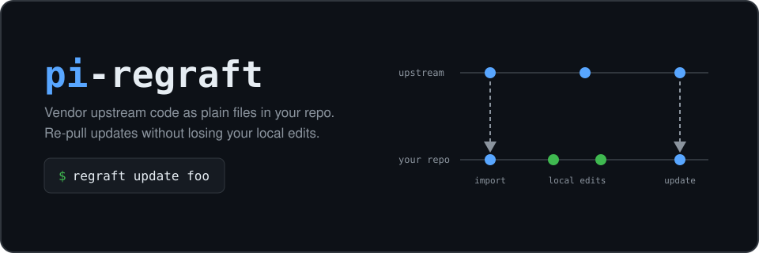

# pi-regraft

<p align="center">
  
</p>

`pi-regraft` is a Pi extension for vendoring code from Git repositories. It lets
you change the copied code in place and pull later upstream changes without
losing your work.

The vendored code stays in your repository as ordinary files. Regraft stores
pristine upstream copies in normal commits on your branch and uses them as
three-way merge bases during updates. It fetches only the new upstream commit.

The package also includes Regrafter, a dedicated Pi agent for resolving update
conflicts, running checks, and pausing when an update needs a product decision.

## Install

Install from npm:

```bash
pi install npm:pi-regraft
```

You can also run the GitHub version without installing it:

```bash
pi -e git:github.com/osolmaz/pi-regraft
```

## First graft

Run Pi at the root of the repository that will receive the files. Add an
upstream repository, tracked ref, optional subdirectory, and destination:

```text
/regraft add https://github.com/example/tool.git@main#extensions/foo vendor/foo
```

The npm package also installs a `regraft` executable for scripts and coding
agents:

```bash
regraft add https://github.com/example/tool.git@main#extensions/foo vendor/foo
```

The destination must be empty. Regraft copies the selected upstream tree into
`vendor/foo` and writes `regraft.json` before creating a commit named
`chore(regraft): import upstream base`.

Edit the copied files after that commit and commit your changes normally. If a
local change has a reason that may matter during conflict resolution, record it
in the manifest:

```text
/regraft note foo "log every failed request"
```

Commit the updated manifest before pulling from upstream.

## Updates

Check whether any tracked ref has advanced:

```text
/regraft status
```

Update one graft by name:

```text
/regraft update foo
```

Regraft reads the old pristine tree from your branch and fetches the new
upstream commit before merging these trees:

1. the old pristine upstream tree
2. your committed local tree
3. the new upstream tree

It commits the new pristine tree before restoring the merged local version in
your worktree. If you made no local changes, the worktree stays clean. If local
changes remain, run your project checks and commit the restored local version.

Text conflicts use normal Git conflict markers. Pi receives the affected file
paths and the notes from `regraft.json`, so the agent can help resolve them.
Regraft also preserves executable bits, symlinks, binary files, and
file-versus-directory changes.

## Commands

```text
/regraft add <url>[@ref][#subdir] [dest]   copy and commit an upstream tree
/regraft update <name>                     pull upstream and restore local edits
/regraft status                            show local bases and upstream status
/regraft note <name> <text>                record why a local edit exists
```

The executable provides the same operations without the leading slash. Add
`--json` to receive one versioned JSON result on stdout. Expected merge
conflicts return a successful `needs_resolution` result so an agent can inspect
and resolve them before running project checks.

## Regrafter

Regrafter keeps one Pi session and one repository lease for each update run. It
can pause for several decisions and resume without losing the conversation or
the exact repository state.

Install the commands and pi-factory, then install the app bundle:

```bash
npm install -g pi-regraft @osolmaz/pi-factory
pi-factory install osolmaz/pi-regraft --yes
```

Point Regrafter at a model from your Pi profile — the same providers, models,
and credentials as your regular `pi`, read in place and never copied:

```bash
regrafter config set model <provider/model>
```

The config lives at `$XDG_CONFIG_HOME/regrafter/config.json` (default
`~/.config/regrafter/config.json`). `regrafter config show` prints the current
selection, `regrafter config set thinking <level>` adjusts the thinking level,
and `regrafter config reset` clears the config. When a model is configured,
runs launch Pi with the ambient profile: the host agent dir provides `auth.json`
and the model catalog, sessions stay in Regrafter's own state directory, and
host extensions, skills, prompt templates, and themes are disabled for the run.
When the configured provider is `huggingface`, the bundled
`pi-huggingface-oauth` extension is loaded so Hugging Face OAuth keeps working.
`regrafter attach` uses the same selection.

Work with Regrafter directly in a repository:

```bash
pi-factory run regrafter --cwd /path/to/repository
```

A main agent or script can drive the same app through bounded controller
commands:

```bash
regrafter start --repo /path/to/repository --request-file task.md --json
regrafter send <run-id> --decision <decision-id> --message-file answer.md --json
regrafter inspect <run-id> --json
regrafter list --repo /path/to/repository --json
regrafter attach <run-id>
regrafter abort <run-id> --json
```

The baseline command grants no authority to create overlay commits, push, or
open pull requests. Grant only the actions the run needs with
`--allow commits,push,pull-requests`. A later `send` may add authority, but it
cannot remove authority already granted.

Regrafter never drops a lease because it is old and never silently chooses
between competing local and upstream behavior. `abort` does not reset files; it
releases the lease only after verifying the repository handoff state.

### Local model server

Without a config file, the bundled app defaults to an OpenAI-compatible model
named `regrafter` at `http://127.0.0.1:1234/v1`. It does not install or start a
model server. Edit the installed `pi-factory.toml` when the endpoint or model
differs.

## Repository requirements

`add` and `update` require an attached Git branch, a clean worktree and index,
and a configured Git author. Git credentials must come from a credential helper
or SSH key. Regraft rejects credentials embedded in source URLs.

An update also refuses to run when ignored, uncommitted files exist inside the
graft. Move or remove those files first so they cannot be erased by the update.

Keep every `chore(regraft): import upstream base` commit in branch history.
Rebasing those commits is safe. Squashing or dropping them removes the merge
bases and blocks future updates.

Regraft fails when a required local base is missing. It never recovers the old
base by fetching the previously pinned commit from upstream.

The full commit model and merge rules are in
[the design document](docs/design.md).

## License

[MIT](LICENSE)
